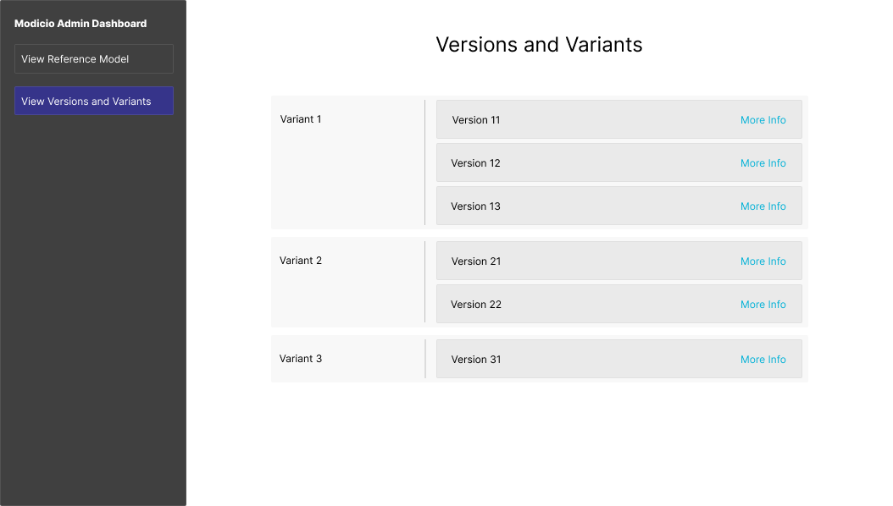

# Admin Panel

## Use Cases

| Use Cases                                        | Description                                                                                                                          |
|--------------------------------------------------|--------------------------------------------------------------------------------------------------------------------------------------|
| Visualize Reference Model                        | Visualize currently selected Reference Model using PlantUML                                                                          |
| See Overview of all Active Variants and Versions | Visualization of variants and Versions                                                                                               |
| Visualize Metadata for each Variant/Version      | For Each Fragment Visualize things like:    - Trace   - Model   - Interface for each Association Relation   - etc... |

## Mockup

### Use Case 1

The Landing Page of the Admin Panel is meant for the Visualization of the Reference Model. 
The Metadata of the associated Fragment is also shown.

### Use Case 2

By using the side Bar to navigate, one can find an overview of all active Variants and their active Versions.
When clicking on the "More Info" Text the next page opens, where the Metadata of the most Recent Fragment of that Version is displayed.

### Use Case 3

This Page shows all the Information about a fragment that might be useful, starting with the Metadata, the trace, the interfaces for the nodes in the model and the HeaderElements for the instances.
A click of the button shows the Model associated with the fragment.

